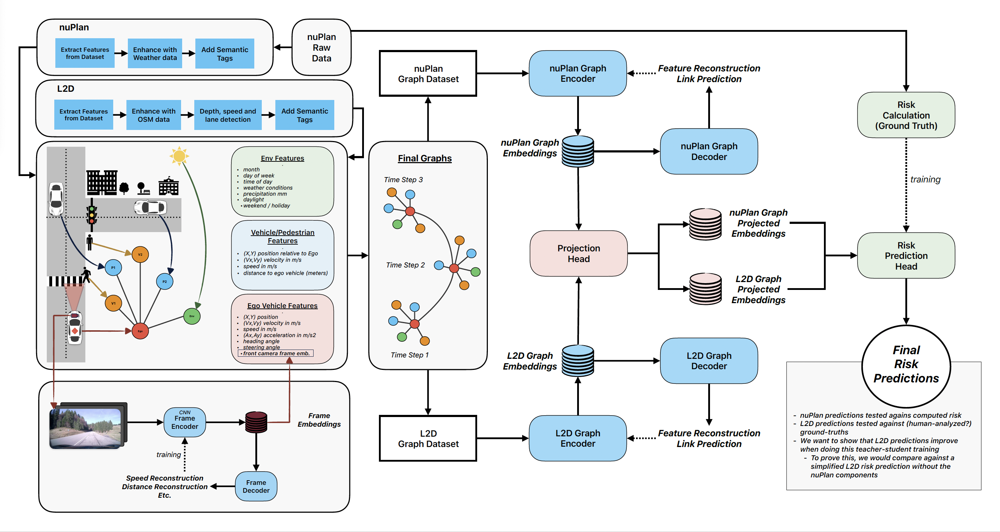

# Traffic Semantic Graphs



## 📁 Directory Overview

```plaintext
TRAFFIC_SEMANTIC_GRAPHS/
├── data/ # Local-only: raw and processed data (not included in repo)
│   ├── graphical/                   # Graph files for L2D and NuPlan datasets
│   ├── processed/                   # Processed tabular data
│   ├── processed_frames/            # Processed image frames (e.g., YOLO, depth outputs)
│   ├── processed_graphical/         # Final graphical data after processing and filtering
│   ├── raw/                         # Raw inputs (images, tabular)
│   └── semantic_tags/               # Semi-manually-generated semantic tags
│
├── functions/ # Python modules for data loading, processing, and visualization
│   ├── data_loaders.py
│   ├── data_stats.py
│   ├── graphs.py
│   ├── load_data_L2D.py
│   ├── load_data_NuPlan.py
│   ├── models.py
│   ├── process_frames_L2D.py
│   ├── process_lanes_L2D.py
│   ├── process_tabular_data_L2D.py
│   ├── process_tags_L2D.py
│   ├── process_tags_NuPlan.py
│   ├── standardization.py
│   └── utils.py
│
├── notebooks/ # Main notebooks
│   ├── 1-graph-generation-l2d.ipynb
│   ├── 2-graph-generation-nuplan.ipynb
│   ├── 3-dataset-alignment.ipynb
│   └── 4-ue-encoder.ipynb
│
├── requirements.txt                 # Python dependencies
└── README.md                        # This file

```
**Note:** The actual data files are not included in the repository due to storage limitations.
