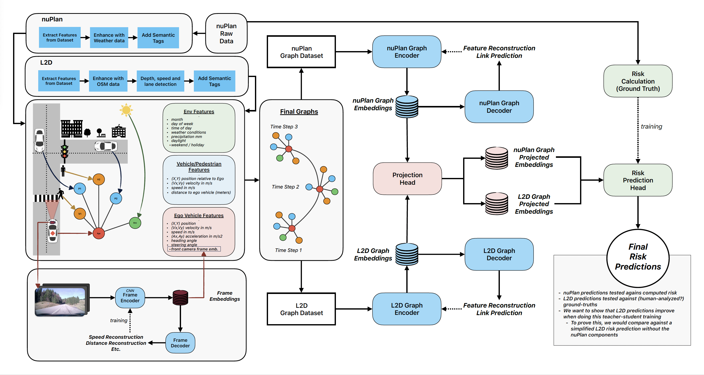

# Traffic Semantic Graphs



## ⚙️ Setup

### 1. Clone the Main Repository

First, clone this main repository to your local machine:

```bash
git clone https://github.com/your-username/your-repository.git
cd your-repository
```

### 2. Clone External Dependencies

This project depends on several external Git repositories that must be cloned into specific local directories. These directories are intentionally ignored by the main project's Git repository (via `.gitignore`) to keep the repository lightweight.

Clone each of the following repositories:

```bash
# Clone nuplan-devkit
git clone https://github.com/motional/nuplan-devkit.git lib/nuplan-devkit

# Clone ml-depth-pro
git clone https://github.com/apple/ml-depth-pro.git lib/ml-depth-pro

# Clone deeplabs
git clone https://github.com/sunggukcha/deeplabs.git lib/deeplabs
```

### 3. Create Conda Environments

This project utilizes two separate Conda environments: `nuplan` and `sem_graphs`. The environment definitions are provided in the `environments/` directory.

Ensure you have Conda installed and initialized in your shell (`conda init`, then restart your terminal if needed).

#### `nuplan` Environment

The `nuplan` environment is specifically used for running the NuPlan data processing script (`1A_nup_processing.py`).

1.  **Create the environment:**
    ```bash
    conda env create -f environments/nuplan_env.yml
    ```
2.  **Activate the environment:**
    ```bash
    conda activate nuplan
    ```
3.  **Install Hardware-Specific Packages:**
    After activating the environment, install PyTorch and its related packages. Please visit the [Official PyTorch Website](https://pytorch.org/get-started/locally/) to find the correct installation command for your specific system (OS, package manager, CUDA version). You will need to install `torch`, `pytorch-lightning`, and `torchmetrics`.

#### `sem_graphs` Environment

The `sem_graphs` environment is used for all other scripts in the pipeline.

1.  **Create the environment:**
    ```bash
    conda env create -f environments/sem_graphs_env.yml
    ```
2.  **Activate the environment:**
    ```bash
    conda activate sem_graphs
    ```
3.  **Install Hardware-Specific Packages:**
    After activating the environment, install PyTorch, PyG (PyTorch Geometric), and related packages.
    *   First, visit the [Official PyTorch Website](https://pytorch.org/get-started/locally/) to find the correct installation command for `torch`, `torchvision`, and `torchaudio` for your system.
    *   Then, visit the [PyG documentation](https://pytorch-geometric.readthedocs.io/en/latest/install/installation.html) for instructions on how to install `pyg` correctly for your new PyTorch version.

## 📁 Directory Overview

```plaintext
TRAFFIC_SEMANTIC_GRAPHS/
├── data/                            # Raw and processed data (ignored by git)
│   ├── raw/                         # Raw L2D and NuPlan inputs
│   ├── training_data/               # Training datasets (clean, noisy, etc.)
│   └── evaluation_data/             # Evaluation datasets
├── environments/                    # Conda environment definition files
├── experiment_results/              # Metrics and CSVs from experimental runs
├── figures/                         # Project figures and visualizations
├── lib/                             # External dependencies
├── models/                          # Model checkpoints (.pt files)
├── scripts/                         # Pipeline and execution scripts
├── src/                             # Core source code modules
│   ├── data_processing/             # Data extraction and transformation
│   ├── graph_encoding/              # Model architectures (GNN, UST)
│   ├── risk_analysis/               # Risk calculation logic
│   └── experiment_utils.py          # Training and eval helpers
└── README.md                        # This file
```

## Phase 1: Data Processing

### 1A: L2D Data Processing

The `1A_l2d_processing.py` script processes the L2D dataset.

**Usage:**
```bash
python -m scripts.1A_l2d_processing [-h] [--min_ep MIN_EP] [--max_ep MAX_EP] [--download] [--process_tabular] [--add_tags] [--process_frames] [--process_lanes] [--process_annotations] [--generate_graphs] [--all]
```

**Arguments:**
- `-h, --help`: show this help message and exit
- `--min_ep MIN_EP`: Minimum episode number to process.
- `--max_ep MAX_EP`: Maximum episode number to process.
- `--download`: Run data download step.
- `--process_tabular`: Run tabular data processing step.
- `--add_tags`: Run tag processing step.
- `--process_frames`: Run frame processing step.
- `--process_lanes`: Run lane processing step.
- `--process_annotations`: Run annotation processing step.
- `--generate_graphs`: Run graph generation step.
- `--all`: Run all steps (default if no flags are set).

### 1A: NuPlan Data Processing

The `1A_nup_processing.py` script processes the NuPlan dataset.

**Usage:**
```bash
python -m scripts.1A_nup_processing [-h] [--city CITY] [--file_min FILE_MIN] [--file_max FILE_MAX] [--episodes EPISODES [EPISODES ...]] [--extract] [--enrich] [--latlon] [--weather] [--weather_codes] [--temporal] [--tags] [--edges] [--lanes]
```

**Arguments:**
- `--city CITY`: City to process (boston or pittsburgh).
- `--file_min FILE_MIN`: Minimum DB file index to process (inclusive).
- `--file_max FILE_MAX`: Maximum DB file index to process (exclusive).
- `--episodes EPISODES [EPISODES ...]`: Specific episodes to process.
- `--extract`: Run only the data extraction and flattening step.
- `--enrich`: Run only the data enrichment and finalization step.
- `--latlon`: Run only the lat/lon addition step.
- `--weather`: Run only the weather enrichment step.
- `--weather_codes`: Run only the weather code replacement step.
- `--temporal`: Run only the temporal feature addition step.
- `--tags`: Run only the tag extraction step.
- `--edges`: Run only the edge processing step.
- `--lanes`: Run only the lane processing step.

### 1B: Final Post-Processing

The `1B_final_processing.py` script performs filtering and enrichment on the generated graph data.

**Usage:**
```bash
python -m scripts.1B_final_processing [-h] [--process_l2d] [--process_nuplan_boston] [--process_nuplan_pittsburgh] [--process_nuplan_las_vegas] [--process_nuplan_mini] [--process_nuplan_singapore] [--combine_nuplan_data] [--nuplan_input_dirs NUPLAN_INPUT_DIRS [NUPLAN_INPUT_DIRS ...]] [--nuplan_output_dir NUPLAN_OUTPUT_DIR]
```

**Arguments:**
- `--process_l2d`: Run L2D final processing.
- `--process_nuplan_boston`: Run NuPlan Boston final processing.
- `--process_nuplan_pittsburgh`: Run NuPlan Pittsburgh final processing.
- `--combine_nuplan_data`: Combine multiple processed NuPlan datasets.
- `--nuplan_input_dirs`: List of NuPlan directories to combine.
- `--nuplan_output_dir`: Output directory for combined NuPlan data.

### 1C: Noise Processing

The `1C_noise_processing.py` script generates noisy versions of the graphs to test model robustness.

**Usage:**
```bash
python -m scripts.1C_noise_processing --data_dir DATA_DIR --output_dir OUTPUT_DIR --noise_level NOISE_LEVEL
```

**Arguments:**
- `--data_dir`: Directory containing the clean graph JSONs.
- `--output_dir`: Directory to save the noisy graphs.
- `--noise_level`: Standard deviation of the Gaussian noise to add.

## Phase 2: Risk Analysis

### 2: Ground-Truth Risk Analysis

The `2_risk_analysis.py` script calculates safety risk scores for each episode based on safety metrics.

**Usage:**
```bash
python -m scripts.2_risk_analysis [-h] [--run_analysis] [--run_on_all_episodes] [--extract_large_risk_eps] [--extract_low_risk_eps] [--risk_statistics] [--dataset DATASET] [--input_directory INPUT_DIRECTORY] [--output_directory OUTPUT_DIRECTORY] [--risk_csv_dir RISK_CSV_DIR] [--output_filename OUTPUT_FILENAME] [--num_episodes NUM_EPISODES] [--threshold THRESHOLD] [--columns COLUMNS [COLUMNS ...]]
```

**Arguments:**
- `--run_analysis`: Run full risk analysis and generate a CSV.
- `--run_on_all_episodes`: Run risk analysis on all episodes in a directory.
- `--extract_large_risk_eps`: Extract episodes with risk above a threshold.
- `--dataset DATASET`: Dataset name (e.g., 'L2D', 'NUP').
- `--output_filename`: Output filename for the JSON file (e.g., 'risk_scores.json').
- `--num_episodes`: Number of episodes to process (for --run_analysis).
- `--threshold`: Risk threshold for episode extraction.

## Phase 3: Baseline Training

### 3A: Average Risk Baseline (Baseline A)

The `3A_avrg_risk.py` script predicts the training set mean or mode class as a constant baseline.

**Usage:**
```bash
python -m scripts.3A_avrg_risk --l2d|--nup --clean|--noisy LEVEL [-h] [--data_root DATA_ROOT] [--mode MODE] [--batch_size BATCH_SIZE] [--num_workers NUM_WORKERS] [--prediction_mode {regression,classification}] [--num_classes NUM_CLASSES] [--save_metrics_json SAVE_METRICS_JSON]
```

### 4A: Autoencoder Risk (Baseline B)

The `4A_ae_risk.py` script trains a Graph Autoencoder and a Risk Prediction Head.

**Usage:**
```bash
python -m scripts.4A_ae_risk --l2d|--nup --clean|--noisy LEVEL [-h] [--train_autoencoder] [--train_risk] [--evaluate] [--load_best_ae] [--hidden_dim HIDDEN_DIM] [--embed_dim EMBED_DIM] [--prediction_mode {regression,classification}] [--num_classes NUM_CLASSES] [--batch_size BATCH_SIZE] [--ae_epochs AE_EPOCHS] [--risk_epochs RISK_EPOCHS] [--best_model_path BEST_MODEL_PATH] [--wandb]
```

**Arguments:**
- `--train_autoencoder`: Train the stage 1 autoencoder for reconstruction.
- `--train_risk`: Train the stage 2 risk prediction head (with frozen encoder).
- `--load_best_ae`: Load the best autoencoder checkpoint before risk training.
- `--hidden_dim`: Dimension of hidden layers.
- `--embed_dim`: Dimension of latent embeddings.
- `--prediction_mode`: Mode for prediction ('regression' or 'classification').

## Phase 4: UST Training

### 5A: UST (Uncertainty-aware Semantic Alignment)

The `5A_ust_risk.py` script implements the UST method using paired clean/noisy anchors.

**Usage:**
```bash
python -m scripts.5A_ust_risk --l2d|--nup --clean ANCHOR_PCT --noisy NOISE_PCT [-h] [--train_autoencoders] [--train_stage2] [--evaluate] [--align_weight ALIGN_WEIGHT] [--consistency_weight CONSISTENCY_WEIGHT] [--batch_size BATCH_SIZE] [--stage2_epochs STAGE2_EPOCHS] [--best_model_path BEST_MODEL_PATH]
```

**Arguments:**
- `--clean`: Percentage of anchor samples from the clean dataset (noisy_true).
- `--noisy`: Percentage of noise in the noisy dataset (e.g., 20).
- `--train_autoencoders`: Train clean and noisy domain autoencoders.
- `--train_stage2`: Perform semantic alignment and risk head training.
- `--align_weight`: Weight for the alignment loss between clean/noisy pairs.
- `--consistency_weight`: Weight for prediction consistency loss.

## Phase 5: Experiments & Visualization

### Run Experiments

The `run_experiments.py` script automates the execution of multiple trials across noise levels and seeds.

**Usage:**
```bash
python -m scripts.run_experiments --experiment {BaselineB,UST} [--noises N1 N2 ...] [--seeds S1 S2 ...] [--anchors A1 A2 ...] [--verbose]
```

### Visualizer

The `visualizer.py` script provides visualization options for graphs and results.

**Usage:**
```bash
python -m scripts.visualizer [-h] [--dataset_path DATASET_PATH] [--episode EPISODE] [--frame FRAME] [--graph_visualizer] [--scene_visualizer] [--histogram HISTOGRAM]
```

**Examples:**

To run the graph visualizer for a specific episode:
```bash
python -m scripts.visualizer --graph_visualizer --episode 1027
```

To run the scene visualizer for a specific episode and frame:
```bash
python -m scripts.visualizer --scene_visualizer --episode 1027 --frame 10
```

To plot a histogram of a specific feature:
```bash
python -m scripts.visualizer --histogram ego-vx
```
